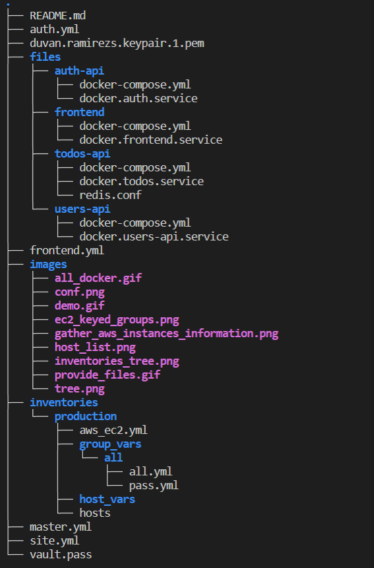
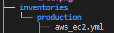
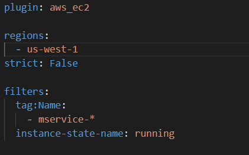
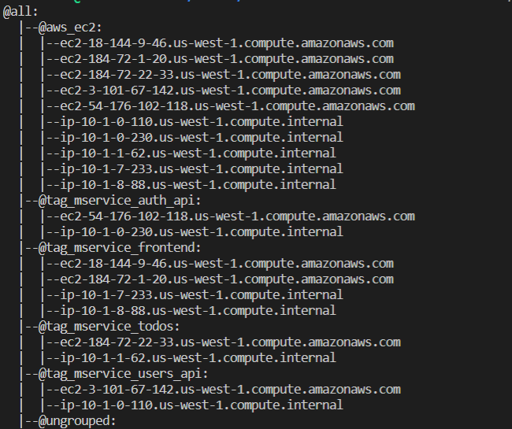
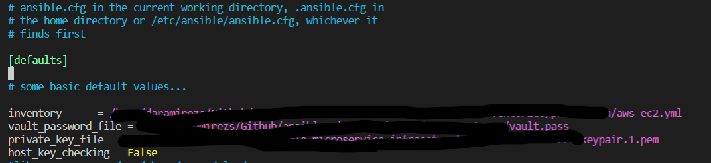
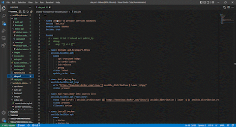
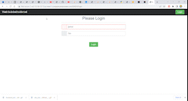

# Ansible microservice app
Ansible ptoject that provides ec2 instances of microservice app :godmode:

## Requirements
* [Ansible](https://docs.ansible.com/ansible/latest/installation_guide/index.html) 

## Creating the layaout structure in Ansible

$mkdir -p group_vars/all/

$cd AWS_Ansible

$touch playbook.yml

## Install EC2 module dependencies

$ pip install boto boto3 

## Create Ansible Vault file to store the AWS Access

$ ansible-vault create group_vars/all/pass.yml 

The password provided here will be asked every time the playbook is executed or when editing the pass.yml file.

We can also provide a vault.pass file to don´t write the password all the time.

$ ansible-playbook playbook.yml --vault-password-file vault.pass

## Tree
[Best Practices](https://docs.ansible.com/ansible/2.8/user_guide/playbooks_best_practices.html#directory-layout)

## Create dynamic inventory

### Library

We are going to use amazon.aws.aws_ec2 inventory

$ansible-galaxy collection install amazon.aws

### Pre requisitos
Use a YAML file configuration ending with aws_ec2.{yml|yaml}.

### Gather public ip from aws instance filtering the name

### Create groups from the tags['Name']

Hosts graph created

## Configurar variables estaticas

 
We configure our aws key .pem path and host_key_checking variable to allow ansible to ssh to our hosts without any issue.

## Install docker and docker-compose in our machines

Once with our dynamic inventory, we are going to install docker and docker compose in all the hosts of our application

$ ansible-playbook <file_name>.yml --vault-password-file vault.pass -i inventories/production/aws_ec2.yml 

## Provide our machines with docker-compose and .service file 

With:
* **ansible.builtin.copy** we can specify the path of the files on our machine to be tranfer to the remote machine

* **ansible.builtin.replace** we modify the .service file (which exposes the docker service) to update the IPs of our services. 

* **ansible.builtin.systemd** we expose and update our service

## Demo application

At the end we execute ansible to provide ours machines.

$ ansible-playbook frontend.yml --vault-password-file vault.pass -i inventories/production/aws_ec2.ym

