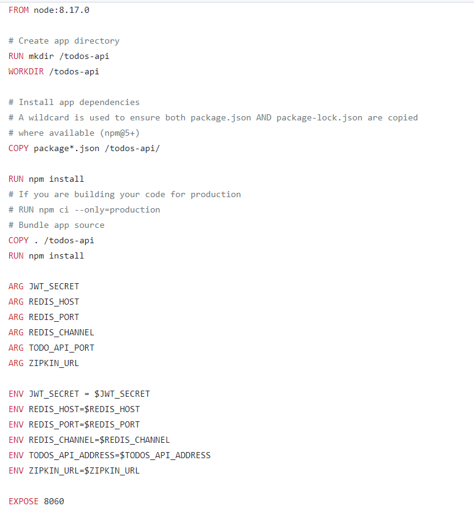

# Create docker images and runing services

## Frontend Dockerfile

### build Dockerfile

$ sudo docker build -t <docerkhub_name>/<image_name>:<version> -t daramirezs/users-api:latest . 

## Users Dockerfile

### build docker 

$ sudo docker build -t daramirezs/users-api:1.0 -t daramirezs/users-api:latest . 

## Auth Dockerfile

$ sudo docker build -t daramirezs/auth-api:1.0 -t daramirezs/auth-api:latest . 

## Todos Dockerfile

$ sudo docker build -t daramirezs/todos-api:1.0 -t daramirezs/todos-api:latest . 

## Deploy service in ec2 instance

Requiremtents: 

* [Install docker](https://docs.docker.com/engine/install/ubuntu/)

Pull image from dockerhub

$ docker pull |user|/|image|:

Run docker

$ sudo docker run -e PORT="8080" -e AUTH_API_ADDRESS=" <service_domain>:<port> " -e TODOS_API_ADDRESS="http://<service_domain>:<port>" -e ZIPKIN_URL=" <service_domain>:<port> " --name frontend -p 8040:8040 -d daramirezs/frontend:1.0 

Checking frontend service:

## Redis service with docker-compose

Logging redis-server

Logging todos-api

Logging log-processor

Application

Zipkin-server

