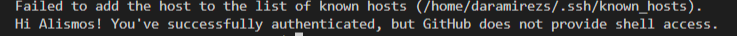

# Configure SSH Keys

You can access and write data in repositories on GitHub.com using SSH (Secure Shell Protocol).

## Generate SSH key 

$ ssh-keygen -t ed25519 -C "your_email@example.com"

This creates a new SSH key, using the provided email as a label.

## Add the SSH key to the ssh-agent

Ensure the ssh-agent is running. 

$ eval "(ssh-agent -s)"

## Add your SSH private key to the ssh-agent. 

$ ssh-add ~/.ssh/id_ed25519

## Add a new SSH key to your Github account

For this step I follow the [Github Docs](https://docs.github.com/es/authentication/
connecting-to-github-with-ssh/adding-a-new-ssh-key-to-your-github-account) 

## Test SSH connection

After these steps we can test the SSH connection 

$ ssh -T git@github.com

In my case

# Configure GPG key

List the GPG keys for which you have a public and private key.

$ gpg --list-secret-keys --keyid-format=long  

Configure your GPG key in git.

$ git config --global user.signingkey <key> 

Add GPG in Github 

Push code

git commit -S -m "<text>” 

## If you have throubles in linux 

$ sudo apt upgrade gnupg 

$ export GPG_TTY=(tty) 

$ echo "test" | gpg --clearsign 

$ git config --global gpg.program gpg2 

$ git config --global commit.gpgsign true

