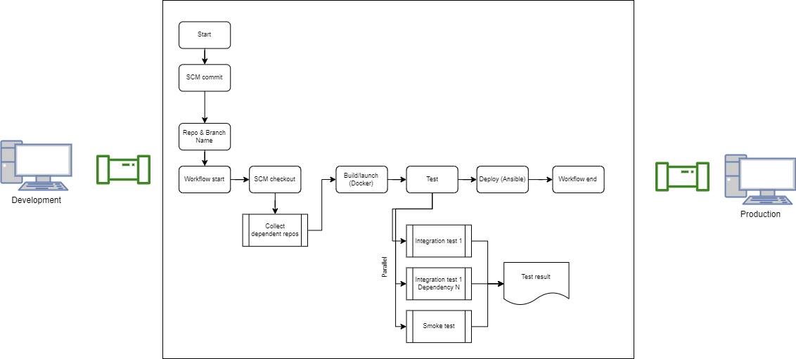
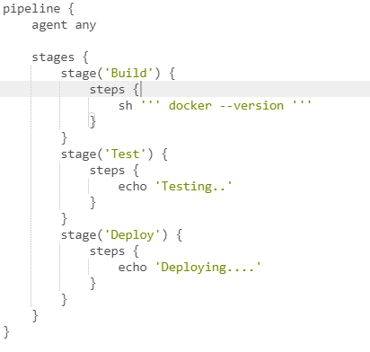
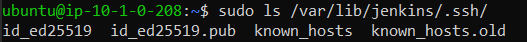
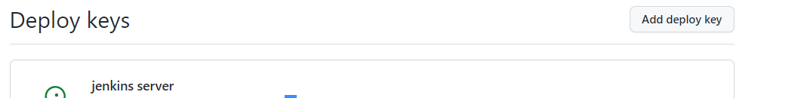
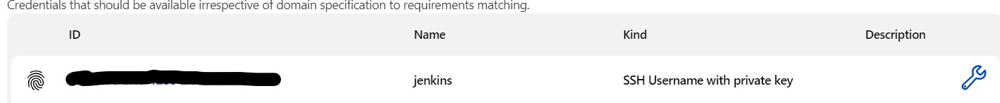
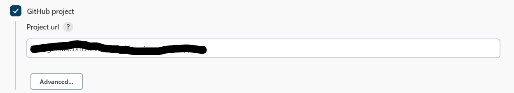
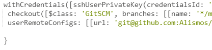
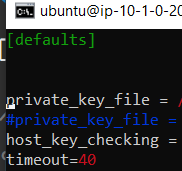
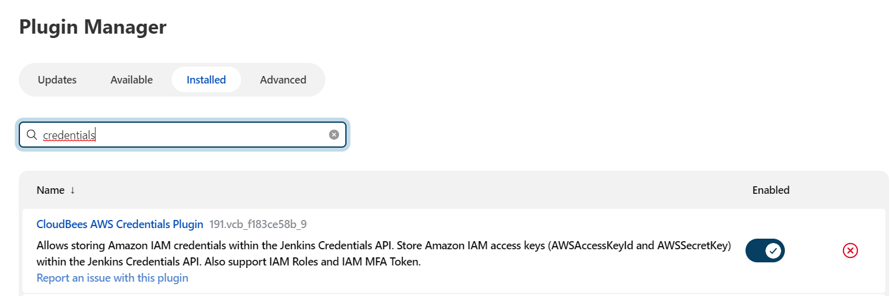

# Jenkins

## Requirements

* Install jenkins in [debian/ubuntu](https://www.jenkins.io/doc/book/installing/linux/#debianubuntu)

* Create EC2 machine in aws 

## Configure Jenkins

When launching jenkins we can create our admin credentials or use the default admin credentials. 

## Pipeline Diagram

## Pipeline Skeleton

First of all we create our pipeline skeleton with the three stages: 
* Build 
* Test
* Deploy

### Prepare Ansible 

 * [Add shh key](https://docs.github.com/en/authentication/connecting-to-github-with-ssh/generating-a-new-ssh-key-and-adding-it-to-the-ssh-agent) to clone Ansible repository 

 * [Add GPG key](https://docs.github.com/es/authentication/managing-commit-signature-verification/generating-a-new-gpg-key) to validate signature in commits to the repositories

## Deploy 

### Configure github credentials
Create key in ec2 with the jenkins profile 

Add key in Github. Project repository >> Settings >> Deploy keys >> Add deploy key 

 Add credential to jenkins.

 Add Github URL to jenkins pipeline. 

 Use credentials in pipeline

### Configure Ansible 

Install [Ansible](https://docs.ansible.com/ansible/latest/installation_guide/intro_installation.html) and libraries dependencies with [python](https://www.scaler.com/topics/python/install-python-on-linux/) in the ec2 machine

$ pip install boto3 botocore

Configure ansible.cfg 

If there isn´t ansible.cfg 

$ sudo mkdir -p /etc/ansible/
$ tocuh /etc/ansible/ansible.cfg

### Create aws credentials in aws 

Install [CloudBees AWS Credentials Plugin](https://plugins.jenkins.io/aws-credentials) in jenkins

Create credentials in jenkins

