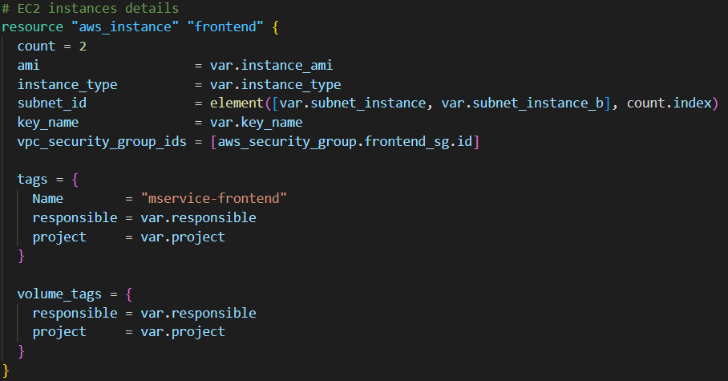

# Microservice infraestructure in AWS

## To be architecture 

## Configuración de Terraform

### Previous requirements 
* [Terraform Cli](https://learn.hashicorp.com/tutorials/terraform/install-cli?in=terraform/aws-get-started)
* [AWS Cli](https://docs.aws.amazon.com/cli/latest/userguide/install-cliv2.html)
* AWS account and [credentials](https://docs.aws.amazon.com/general/latest/gr/aws-sec-cred-types.html) 

To use IAM credentials to authenticate the Terraform AWS provider, the AWS_ACCESS_KEY_ID environment variable must be set.

**$ export AWS_ACCESS_KEY_ID=<aws_key_id>**

Secret key.

**$ export AWS_SECRET_ACCESS_KEY=<aws_secret>**

main.tf file with the terraform settings and deploy ec2 instances.

The terraform {} block contains the Terraform configuration, including any necessary providers that Terraform will use to provide the infrastructure.

## Desplegar instancias ec2 

The resource block is used to define the components of your infrastructure. In this case we will define the ec2 instances.

Once our architecture is defined.

**$terraform init**

Once our architecture is defined.

**$terraform fmt**

To format our code.

**$terraform apply**

To deploy our architecture

## Configuration variables

The directory **variables.tf** contains all the variables for configuring our resources. 

## Security groups

To configure our security group we are to create the rules allowing ssh to our machine, the slave we are going to configure in jenkins and the port our api is going to expose.

EC2 intance in aws

## Load balancer

We are going to define our target group in the vpc the load balancer is going to target. 

After creating our target groupd we must attach the required EC2 Instances with the target group.

Creation of the Application Load Balancer.

Attach the listener rule for the ALBs created

Load balancer in aws

## Optional
### Providing

To provide our machines we must determine the applications that it needs, the files to deploy our application and the hosts where the null resource is going to be connected. 

## Demo

